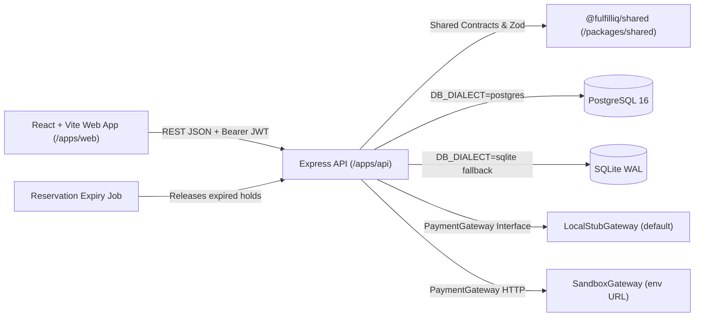
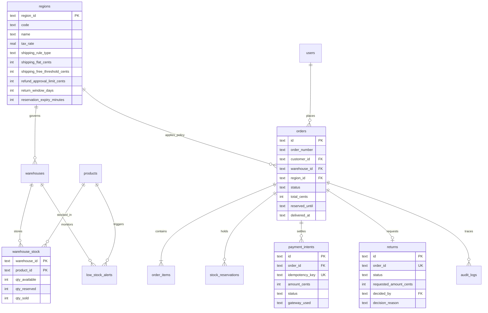
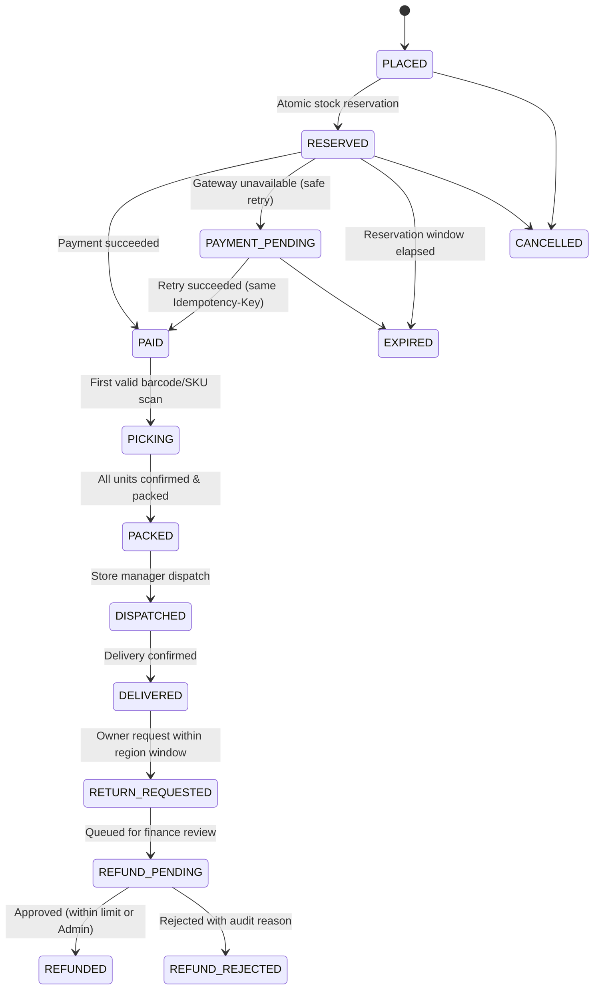

# FulfillIQ Architecture & Data Model

## System Architecture

```mermaid
flowchart LR
  Web["React + Vite Web App (/apps/web)"] -->|REST JSON + Bearer JWT| Api["Express API (/apps/api)"]
  Api -->|Shared Contracts & Zod| Shared["@fulfilliq/shared (/packages/shared)"]
  Api -->|DB_DIALECT=postgres| Pg[("PostgreSQL 16")]
  Api -->|DB_DIALECT=sqlite fallback| Sqlite[("SQLite WAL")]
  Api -->|PaymentGateway Interface| Stub["LocalStubGateway (default)"]
  Api -->|PaymentGateway HTTP| Sandbox["SandboxGateway (env URL)"]
  Job["Reservation Expiry Job"] -->|Releases expired holds| Api
```

## Entity-Relationship Diagram

```mermaid
erDiagram
  regions ||--o{ warehouses : governs
  regions ||--o{ orders : applies_policy
  warehouses ||--o{ warehouse_stock : stores
  products ||--o{ warehouse_stock : stocked_in
  users ||--o{ orders : places
  orders ||--|{ order_items : contains
  orders ||--o{ stock_reservations : holds
  orders ||--o{ payment_intents : settles
  orders ||--o| returns : requests
  warehouses ||--o{ low_stock_alerts : monitors
  products ||--o{ low_stock_alerts : triggers
  orders ||--o{ audit_logs : traces

  regions {
    text region_id PK
    text code
    text name
    real tax_rate
    text shipping_rule_type
    int shipping_flat_cents
    int shipping_free_threshold_cents
    int refund_approval_limit_cents
    int return_window_days
    int reservation_expiry_minutes
  }
  warehouse_stock {
    text warehouse_id PK
    text product_id PK
    int qty_available
    int qty_reserved
    int qty_sold
  }
  orders {
    text id PK
    text order_number
    text customer_id FK
    text warehouse_id FK
    text region_id FK
    text status
    int total_cents
    text reserved_until
    text delivered_at
  }
  payment_intents {
    text id PK
    text order_id FK
    text idempotency_key UK
    int amount_cents
    text status
    text gateway_used
  }
  returns {
    text id PK
    text order_id UK
    text status
    int requested_amount_cents
    text decided_by FK
    text decision_reason
  }
```

## Operational Order State Machine

```mermaid
stateDiagram-v2
  [*] --> PLACED
  PLACED --> RESERVED : Atomic stock reservation
  PLACED --> CANCELLED
  RESERVED --> PAID : Payment succeeded
  RESERVED --> PAYMENT_PENDING : Gateway unavailable (safe retry)
  RESERVED --> EXPIRED : Reservation window elapsed
  RESERVED --> CANCELLED
  PAYMENT_PENDING --> PAID : Retry succeeded (same Idempotency-Key)
  PAYMENT_PENDING --> EXPIRED
  PAID --> PICKING : First valid barcode/SKU scan
  PICKING --> PACKED : All units confirmed & packed
  PACKED --> DISPATCHED : Store manager dispatch
  DISPATCHED --> DELIVERED : Delivery confirmed
  DELIVERED --> RETURN_REQUESTED : Owner request within region window
  RETURN_REQUESTED --> REFUND_PENDING : Queued for finance review
  REFUND_PENDING --> REFUNDED : Approved (within limit or Admin)
  REFUND_PENDING --> REFUND_REJECTED : Rejected with audit reason
```
